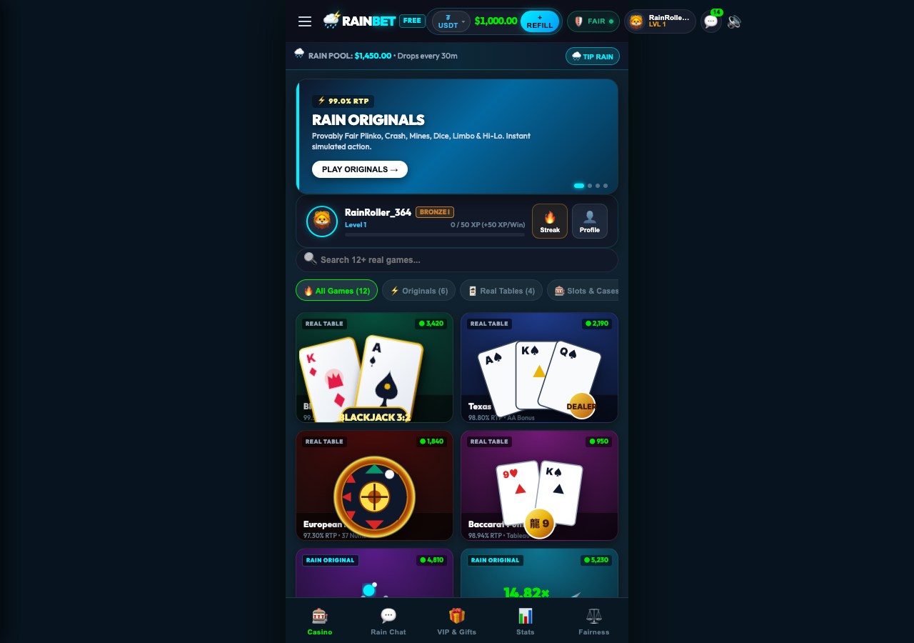

# 🌧️ RainStake Mobile — Simulated Crypto Casino Game

> **100% Free-to-Play Mobile Game • Simulated Money Only • Zero Real Gambling**  
> A faithful mobile-optimized recreation of the signature games, aesthetics, and community mechanics from **Stake.com** and **Rainbet**.



---

## 📱 Live Local Server
The application is running locally at:
👉 **[http://localhost:3000](http://localhost:3000)**

*(Or open [index.html](file:///Users/andrewhains/.gemini/antigravity-ide/scratch/rainstake-mobile/index.html) in your browser)*

---

## 🎮 Included Casino Originals (All Fully Playable)

### 1. 🟣 Plinko (Stake's Flagship Game)
- **Physics Canvas Engine**: Dynamic 2D ball-peg collision physics with restitution, deflection impulses, and wall bounces at 60 FPS.
- **Customizable Rows**: Choose between **8, 10, 12, 14, or 16 rows**.
- **Risk Profiles**: Low, Medium, and **High Risk (up to 1,000× jackpot on outer buckets!)**.
- **Multi-Ball Dropping**: Tap repeatedly to drop a cascade of colorful bouncy balls, or toggle **Auto Drop** mode.
- **Real-Time Multiplier Feed**: Live badge trail showing your recent bucket multipliers.

### 2. 🚀 Crash (The Rocket Multiplier Curve)
- **Real-Time Exponential Curve**: Rocket climbs along an accelerated mathematical curve ($1.00\times \dots 10.00\times \dots 100\times+$) emitting glowing particle exhaust.
- **Interactive Cash Out**: Dynamically calculated cashout button displaying current payout in real-time.
- **Auto Cashout**: Set a target multiplier (e.g. $2.00\times$) to automatically secure your profit.
- **Dramatic Bust & Explosion**: If the rocket crashes before cashout, it detonates in red and gold explosion particles with authentic bust audio.

### 3. 💎 Mines (5×5 Suspense Grid)
- **Customizable Mine Count**: Select from 1 up to 24 mines hidden beneath the 25 tiles.
- **Combination Probability**: Uses authentic combinatorics $0.99 \times \frac{\binom{25}{k}}{\binom{25-m}{k}}$ for true-to-life casino odds.
- **Next Tile Indicator**: Displays your Current Multiplier, Next Tile Multiplier, and Total Cashout value.
- **End-of-Game Reveal**: Flips all remaining tiles showing where hidden gems and skulls were placed.

### 4. 🎲 Dice (0.00–100.00 Slider)
- **Interactive Range Slider**: Move target between 1.00 and 98.00.
- **Roll Over / Roll Under**: One-tap toggle switching between win zones.
- **Real-Time Probability Calculator**: Dynamically updates Win Chance % and Multiplier (e.g. 49.50% Win Chance = 2.00× Multiplier).
- **Animated Marker**: Fast-cycling roll indicator snaps to the final roll with glowing win/loss animation.

### 5. 🃏 Real Blackjack (Vegas Rules Table)
- **Authentic Felt Experience**: Green velvet casino felt with dealer shoe and player station.
- **Rules & Payoffs**: Natural Blackjack pays **3:2**, Dealer stands on soft 17, insurance pays 2:1.
- **Player Actions**: **HIT**, **STAND**, and **DOUBLE DOWN** (doubles bet and receives exactly one card).
- **Intelligent Dealer AI**: Flips the hole card with realistic dealing pauses, drawing until reaching 17+.

### 6. ♠️ Real Texas Hold'em / Casino Hold'em Poker
- **Authentic 7-Card Evaluator**: Full combinatorial hand ranker (Royal Flush, Straight Flush, Quads, Full House, Flush, Straight, Three of a Kind, Two Pair, One Pair, High Card).
- **Full Poker Betting Rounds**: Initial Ante ➔ Deal Hole Cards ➔ 3-Card Flop ➔ Check or Call (2× Ante) ➔ Turn & River cards dealt.
- **Dealer Qualification**: Dealer must hold a pair of 4s or better to qualify, with genuine ante bonus multipliers for high-ranking hands (up to 100:1 for a Royal Flush).

### 7. 🎡 Real European Roulette (Single-Zero 37-Pocket Wheel)
- **Canvas Physics Wheel**: 37-pocket European roulette wheel with decelerating inner ball physics and pocket settling.
- **Comprehensive Felt Betting Board**: Inside bets (Straight up 35:1) and outside bets: Red/Black (1:1), Odd/Even (1:1), 1-18/19-36 (1:1), Dozens (2:1), and Columns (2:1).
- **Recent Winning Numbers Board**: Live ticker showing color-coded hot/cold wheel results.

### 8. 👑 Real Punto Banco Baccarat (Macau Table Rules)
- **Tableau Rules**: Exact international third-card tableau drawing logic for both Player and Banker.
- **Side Bets**: Bet on Player (1:1), Banker (0.95:1 with 5% commission), or Tie (8:1).
- **Natural 8 & 9 Checks**: Immediate round resolution when either hand scores a natural.
- **Bead Plate Roadmap**: Visual history grid tracking Banker (Red), Player (Blue), and Tie (Green) trends.

### 9. 📈 Limbo (Stake Classic)
- **Target Multiplier**: Set any target from 1.01× up to **1,000,000×**!
- **Dynamic Probability**: Instant calculation of win chance % ($99 / \text{target}$).
- **Instant Roll Speed**: High-speed multiplier rolls for fast-paced action.

### 10. 🔼 Hi-Lo (Stake Classic)
- **Higher or Lower**: Predict whether the next card is higher/same or lower/same.
- **Streak Compounding**: Each consecutive correct guess multiplies your payout further!
- **Cash Out Anytime**: Lock in profits at any card, or skip tricky cards (like an 8).

### 11. 🎰 Rain Slots (5×3 Video Slot Machine)
- **Authentic Reels & Paylines**: 10 fixed paylines with Diamonds, Crowns, Wild 7s, Golden Bells, Clovers, and Cherries.
- **🌧️ Rain Storm Free Spins**: Hitting 3 or more Raindrop Scatter symbols triggers **8 Free Spins with a 3× Multiplier** on all wins!
- **Winning Line Highlight**: Glowing golden cells and big win banners.

### 12. ⚡ Lightning Link (Real-Life Hold & Spin Pokie)
- **Hold & Spin Feature**: Triggered by landing 6+ glowing golden lightning orbs.
- **3 Respin Mechanics**: Resets to 3 respins on every newly locked orb.
- **Tiered Jackpots**: Win Mini, Minor, Major, and the progressive **Grand Jackpot** by filling the 15-cell reel grid!

### 13. 🏛️ Gates of Olympus (Pragmatic-style Tumbling Reels)
- **6×5 Cascading Grid**: Cluster pays anywhere on the screen with tumbling cascade reactions.
- **Zeus Multiplier Orbs**: Random wings of Zeus cast lightning multipliers from 2× up to **500×**.
- **Free Spins Bonus**: 4+ Scatter Zeus symbols trigger 15 Free Spins where multipliers accumulate for colossal payouts!

### 14. 📦 Mystery Cases (Rainbet Unboxing Feature)
- **3 Case Tiers**: Starter Rain ($25), Cyber Neon ($100), and High Roller Vault ($500).
- **Horizontal Deceleration Reel**: 45-card scrolling carousel with cubic-bezier physics and needle ticks.
- **Rarity System**: Common, Rare, Epic, and Legendary jackpot drops (up to 50× return).

---

## 🌧️ The Signature "Rain" Community Drop System
- **Live Simulated Chatroom**: Active chat stream with realistic player avatars, win announcements, and banter.
- **Rain Alerts**: Every 45–60 seconds (or when triggered by high rollers), the Rain Bot announces a **Simulated Rain Drop**!
- **Interactive Rain Particle Canvas**: Golden drops shower down across the entire mobile screen.
- **One-Tap Claim**: Players have 20 seconds to tap **CLAIM RAIN** for an instant $50–$250 bonus.
- **"Make It Rain" Button**: Players can tip simulated chips into the community pool to trigger rain for everyone and earn 1.5× bonus VIP XP!

---

## 👑 VIP Progression, Rakeback & Rewards
- **VIP Ladder**: Bronze ➔ Silver ➔ Gold ➔ Platinum ➔ Diamond ➔ Rain God.
- **Level-Up Progression**: Earn XP with every single bet ($1 wagered = 1 XP).
- **Accumulated Rakeback**: A percentage of every bet goes into your personal Rakeback Vault, claimable at any time.
- **🎡 Lucky Fortune Wheel**: Spin the 8-slice canvas wheel once every session for simulated prizes up to **$10,000**!
- **💧 Instant Free Faucet**: Running low on chips? Tap **+ FAUCET** anytime in the top bar to immediately receive **+$1,000.00 free chips**. You can never go broke.

---

## 🔊 Procedural Web Audio API Sound Synthesizer
- Zero external MP3 downloads or slow network requests.
- Synthesizes clicks, chips, card deals, plinko peg hits (pitch-shifted by row), rocket thrust hums, cashout fanfares, explosions, slot reel ticks, and rain drop chimes in real-time.
- Mobile haptic vibration feedback via `navigator.vibrate`.

---

## ⚖️ 100% Provably Fair Simulator
- Real SHA-256 server seed hashing and editable client seeds.
- Transparent Nonce increment counter.
- "Generate New Seed Pair" button to simulate fair crypto verification.

---

## 📂 Project Structure
```
/Users/andrewhains/.gemini/antigravity-ide/scratch/rainstake-mobile/
├── index.html            # Mobile-first app layout & game viewports
├── css/
│   └── style.css         # Dark theme (#0f212e), neon glows, card felts, mobile dock
├── js/
│   ├── audio.js          # Procedural Web Audio API sound synthesizer
│   ├── state.js          # Simulated economy, VIP ladder, localStorage persistence
│   ├── rain.js           # Rain drops canvas effect & live chat simulator
│   ├── rewards.js        # Lucky Wheel canvas & VIP rakeback
│   ├── app.js            # Main controller, unified thumb dock, navigation
│   └── games/
│       ├── blackjack.js  # Real Vegas rules Blackjack with 3:2 payout & dealer AI
│       ├── poker.js      # Real Texas/Casino Hold'em with 7-card evaluator & Flop/Turn/River
│       ├── roulette.js   # Real European single-zero canvas wheel & betting board
│       ├── baccarat.js   # Real Punto Banco Baccarat with tableau rules & bead roadmap
│       ├── plinko.js     # Plinko canvas physics engine (8-16 rows, low/med/high)
│       ├── crash.js      # Crash rocket multiplier curve & auto cashout
│       ├── mines.js      # Mines 5x5 grid & combination math
│       ├── dice.js       # Dice slider & roll over/under
│       ├── limbo.js      # Limbo rocket roll up to 1,000,000x multiplier
│       ├── hilo.js       # Hi-Lo higher/lower card compounding streak
│       ├── slots.js      # 5x3 video slot & Free Spins scatter bonus
│       └── cases.js      # Rainbet case opening horizontal unboxing tape
└── README.md             # Documentation & setup guide
```
